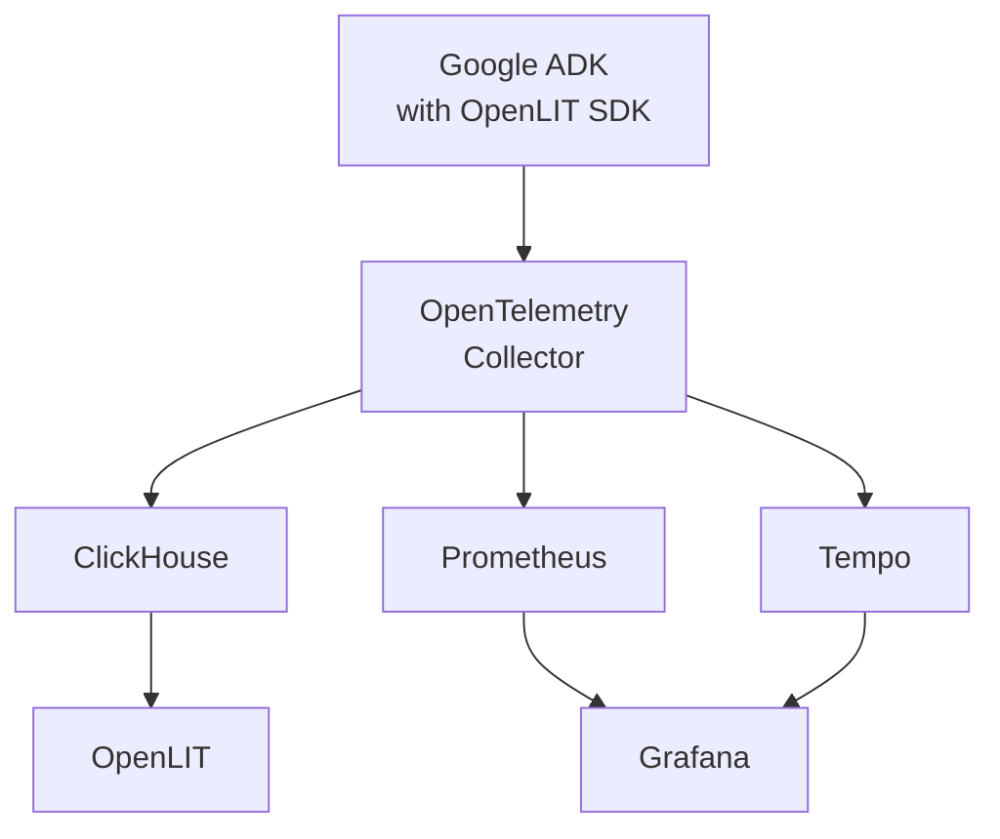
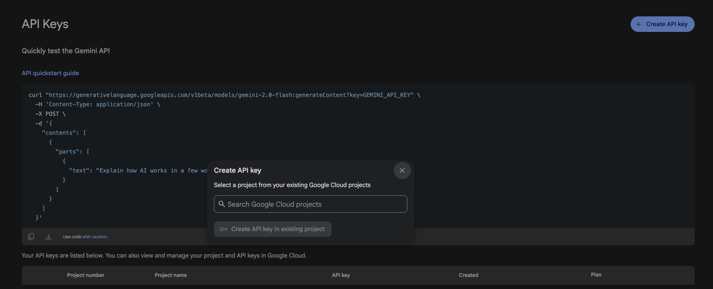
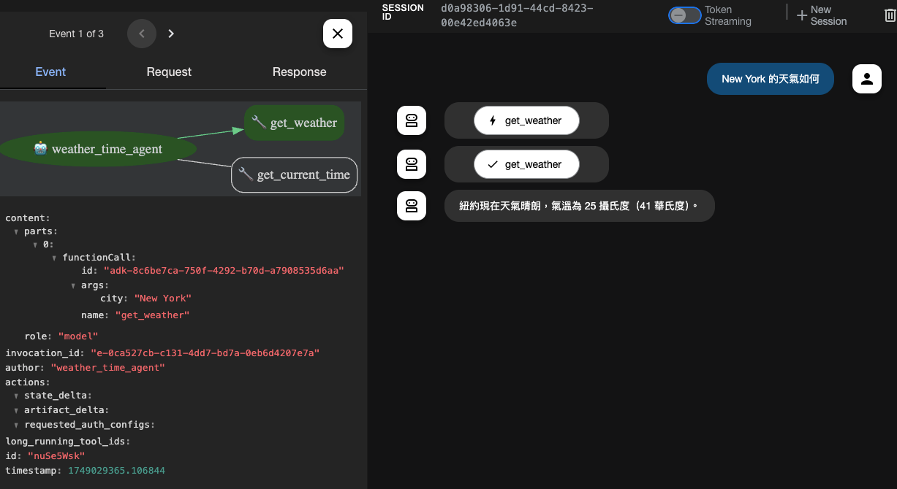
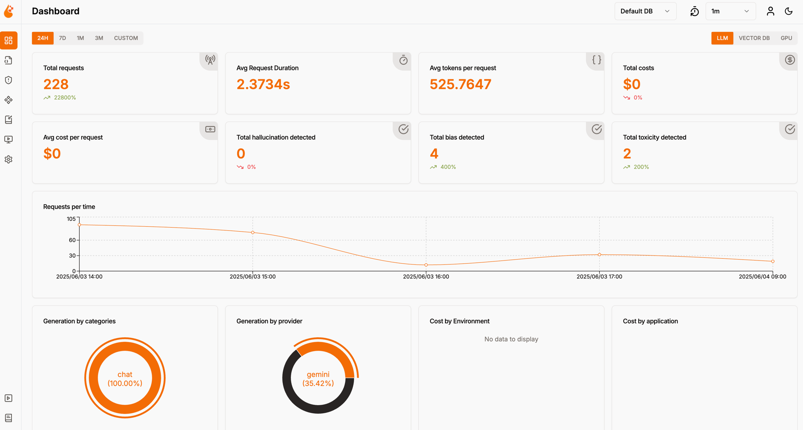
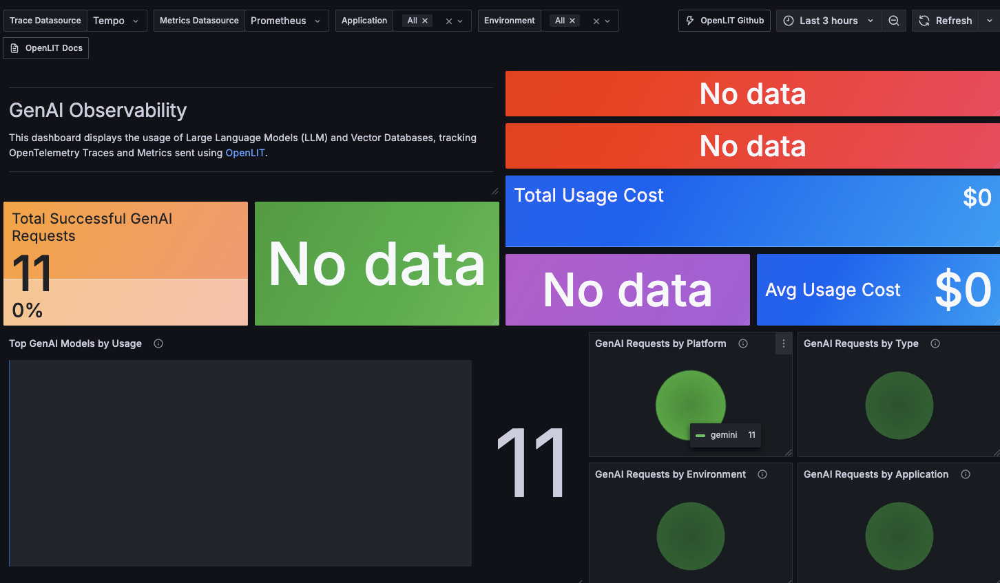

# 2025 LLM Observability Bootcamp

歡迎參加 2025 DevOpsDays Taipei LLM 可觀測性 Bootcamp！

## 📋 概述

這個 bootcamp 將帶您完整體驗 LLM 應用程式的可觀測性，從建構 LLM 代理應用程式，到收集遙測數據，最後進行視覺化分析。我們將使用業界標準的工具和技術，讓您體驗與現有可觀測性工具整合的完整流程。

## 🏗️ 整體架構



### 技術堆疊

- **LLM 代理框架**: Google ADK (Agent Development Kit)
- **可觀測性 SDK**: OpenLIT SDK (內建於 ADK)
- **資料收集**: OpenTelemetry Collector
- **資料儲存**: ClickHouse + Prometheus + Tempo
- **視覺化工具**: 
  - OpenLIT 儀表板 (查詢 ClickHouse)
  - Grafana 儀表板 (查詢 Prometheus + Tempo)
- **容器化**: Docker & Docker Compose

### 🔄 資料流向說明

1. **ADK 應用程式** 內建 OpenLIT SDK，自動收集 LLM 呼叫的遙測資料
2. **OpenLIT SDK** 將資料發送到 **OpenTelemetry Collector**
3. **OpenTelemetry Collector** 將資料分發到三個目標：
   - **ClickHouse**: 儲存所有資料（logs, traces, metrics）供 OpenLIT 查詢
   - **Prometheus**: 透過 Remote Write 儲存指標資料供 Grafana 查詢
   - **Tempo**: 透過 OTLP 儲存追蹤資料供 Grafana 查詢
4. **OpenLIT 後端** 查詢 ClickHouse 提供專業的 LLM 可觀測性儀表板
5. **Grafana** 查詢 Prometheus 和 Tempo 提供通用的監控儀表板

## 🚀 前置準備作業

### 1. 環境需求

確保您的系統已安裝以下工具：

- **Docker**: >= 20.10.0
- **Docker Compose**: >= 2.0.0
- **Git**: 最新版本

### 2. 獲取 Google AI Studio API 金鑰



1. 前往 [Google AI Studio](https://aistudio.google.com/apikey)
2. 登入您的 Google 帳戶
3. 點選「Create API Key」建立新的 API 金鑰
4. 複製並妥善保存您的 API 金鑰


> 💡 **提示**: Google AI Studio 提供免費的 Gemini API 配額，適合本次 bootcamp 使用。

### 3. 下載 Docker 鏡像（可選）

為了節省時間，您可以預先下載鏡像（或直接跳過此步驟，Docker Compose 會自動下載）：

```bash
# 可選：預先下載鏡像以節省啟動時間
docker compose -f adk/docker-compose.yaml pull
docker compose -f openlit/docker-compose.yaml pull  
docker compose -f grafana/docker-compose.yaml pull
```

### 4. 複製專案並設定環境

```bash
# 複製專案
git clone https://github.com/MikeHsu0618/2025-llm-observability-bootcamp.git
cd 2025-llm-observability-bootcamp

# 設定 ADK 環境變數
cd adk/code_optimizer
cp .env.example .env
# 編輯 .env 檔案，填入您的 Google API Key

cd ../multi_tool_agent  
cp .env.example .env
# 編輯 .env 檔案，填入您的 Google API Key

cd ../..  # 回到根目錄

# 一鍵啟動所有服務
docker compose -f openlit/docker-compose.yaml up -d
docker compose -f adk/docker-compose.yaml up -d  
docker compose -f grafana/docker-compose.yaml up -d
```

### 🌐 服務位址
- **ADK Web UI**: http://localhost:8000
- **OpenLIT 儀表板**: http://localhost:3000 (`user@openlit.io` / `openlituser`)
- **Grafana 儀表板**: http://localhost:3300 (免登入)

## 📚 Bootcamp 體驗順序

### 第一階段：建構 LLM 代理應用程式 (ADK)

🎯 **目標**: 學習使用 Google ADK 建構智能代理，體驗多工具整合與代理編排



**前往**: [`adk/`](./adk/README.md)

在這個階段，您將會：
- 使用 ADK Web UI 建構程式碼優化管線代理
- 建立多工具整合代理
- 理解代理編排的概念
- 體驗 ADK 的核心功能
- **服務位址**: http://localhost:8000

---

### 第二階段：遙測數據收集 (OpenLIT)

🎯 **目標**: 收集 LLM 應用程式的遙測數據，了解 OpenTelemetry 標準



**前往**: [`openlit/`](./openlit/README.md)

在這個階段，您將會：
- 使用 OpenLIT 儀表板查看遙測數據
- 收集 LLM 呼叫的遙測數據
- 理解 OpenTelemetry 數據格式
- 體驗數據採集和處理流程
- **服務位址**: http://localhost:3000
- **預設登入**: `user@openlit.io` / `openlituser`

---

### 第三階段：資料視覺化分析 (Grafana)



🎯 **目標**: 將遙測數據整合到 Grafana，建立專業的監控儀表板

**前往**: [`grafana/`](./grafana/README.md)

在這個階段，您將會：
- 使用預配置的 Grafana 儀表板
- 查看 LLM 效能監控儀表板
- 分析成本、延遲、錯誤率等關鍵指標
- 體驗與現有可觀測性工具的整合
- **服務位址**: http://localhost:3300
- **免登入存取**（已啟用匿名模式）

## 📊 學習成果

完成此 bootcamp 後，您將能夠：

1. **建構可觀測的 LLM 應用程式**: 使用 ADK 建立具備遙測功能的智能代理
2. **設計可觀測性架構**: 理解 LLM 應用程式的可觀測性需求和最佳實務
3. **整合監控工具**: 將 LLM 遙測數據整合到現有的監控基礎設施
4. **分析 LLM 效能**: 監控成本、效能、品質等關鍵指標
5. **故障排除**: 使用可觀測性數據快速定位和解決問題

## 🔧 故障排除

### 常見問題

**Q: Docker 容器啟動失敗**
```bash
# 檢查 Docker 服務狀態
docker --version
docker compose version

# 清理舊的容器和網路
docker system prune -f
```

**Q: API 金鑰無效**
```bash
# 測試 API 金鑰
curl -H "Content-Type: application/json" \
     -d '{"contents":[{"parts":[{"text":"Hello"}]}]}' \
     "https://generativelanguage.googleapis.com/v1beta/models/gemini-pro:generateContent?key=YOUR_API_KEY"
```

**Q: 連接 OpenTelemetry Collector 失敗**
```bash
# 檢查 Collector 是否運行
docker ps | grep otel
curl -v http://localhost:4318/v1/traces
```

## 📞 支援

如果在 bootcamp 過程中遇到任何問題，請：

1. 查看各階段的 README 檔案
2. 檢查 Docker 容器日誌：`docker compose logs [service-name]`
3. 參考故障排除部分
4. 向講師或助教尋求協助

---

**祝您學習愉快！🎉**

> 💡 **提醒**: 請按照順序完成各個階段，每個階段都會為下一階段奠定基礎。
