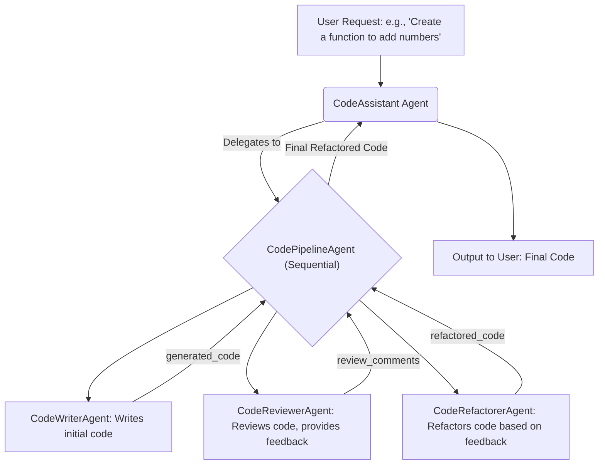
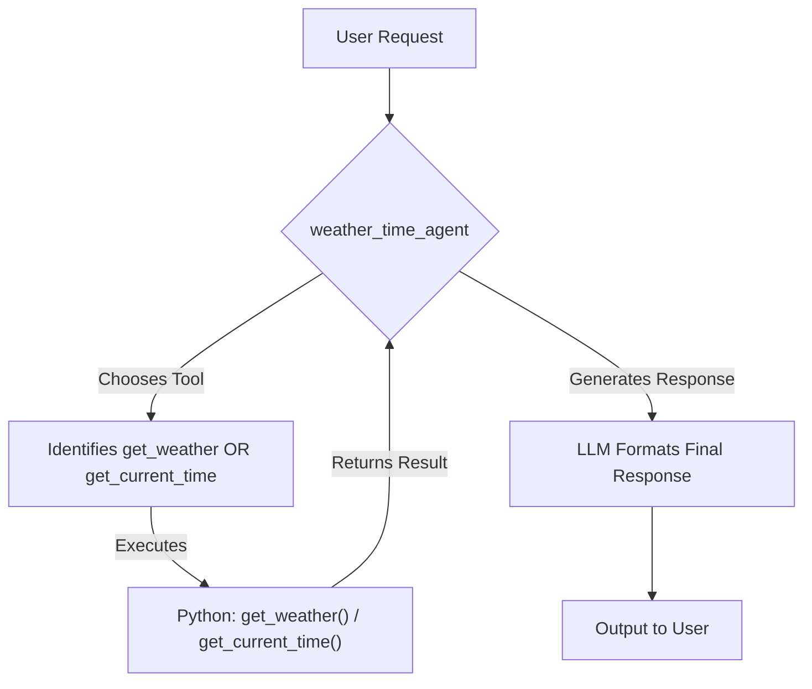

# Google ADK (Agent Development Kit) Workshop

歡迎參加 ADK 工作坊！此目錄包含兩個範例，旨在幫助您快速上手 Google ADK，並了解其在代理編排和函式呼叫方面的核心功能。

## 目錄結構

```
adk/
├── code_optimizer/       # 範例 1: 程式碼優化管線
│   ├── agent.py
│   └── README.md
├── multi_tool_agent/     # 範例 2: 多工具代理
│   ├── agent.py
│   └── README.md
└── README.md             
```

## 範例概覽

### 1. 程式碼優化器 (`code_optimizer`)

此範例展示了如何使用 ADK 建構一個多步驟的程式碼處理管線，模擬了程式碼撰寫、審查和重構的流程。它突顯了 ADK `SequentialAgent` 在編排多個子代理依序執行方面的能力。

**代理流程:**



詳細說明請參閱 [`adk/code_optimizer/README.md`](./code_optimizer/README.md)。

### 2. 多工具代理 (`multi_tool_agent`)

此範例展示了如何建構一個能夠使用多個自訂工具 (Python 函式) 的代理。它演示了 ADK 如何使大型語言模型 (LLM) 能夠根據使用者請求，智慧地選擇並執行合適的函式，並利用函式回傳結果來產生回應。

**函式呼叫流程:**



詳細說明請參閱 [`adk/multi_tool_agent/README.md`](./multi_tool_agent/README.md)。

## 開始使用

### 環境準備

1.  **Docker & Docker Compose**: 本工作坊使用容器化部署，無需手動安裝 Python 或 ADK。

2.  **Google AI API 金鑰設定**: 
    ```bash
    # 設定 code_optimizer 環境變數
    cd code_optimizer
    cp .env.example .env
    # 編輯 .env 檔案：
    # GOOGLE_API_KEY=your-actual-api-key-here
    # GOOGLE_GENAI_USE_VERTEXAI=FALSE
    
    # 設定 multi_tool_agent 環境變數  
    cd ../multi_tool_agent
    cp .env.example .env
    # 編輯 .env 檔案：
    # GOOGLE_API_KEY=your-actual-api-key-here
    # GOOGLE_GENAI_USE_VERTEXAI=FALSE
    ```

3.  **啟動 ADK Web UI**:
    ```bash
    cd .. # 回到 adk 目錄
    docker compose up -d
    ```

### 執行範例

透過 ADK Web UI 體驗代理功能：

1.  **存取 Web UI**: 前往 http://localhost:8000
2.  **選擇代理**: 在 Web UI 中可以看到兩個預載的代理
   - **Code Optimizer**: 程式碼優化管線代理
   - **Multi Tool Agent**: 多工具整合代理
3.  **互動測試**: 直接在 Web UI 中與代理互動，無需撰寫程式碼

### 可觀測性整合

本工作坊已自動整合 OpenLIT SDK 進行可觀測性追蹤：

*   **自動追蹤**: ADK 代理的所有 LLM 呼叫都會自動發送遙測資料到 OpenTelemetry Collector
*   **無需額外設定**: OpenLIT SDK 已內建於 Docker 映像中
*   **資料流向**: ADK → OpenTelemetry Collector → ClickHouse/Prometheus/Tempo

## 工作坊目標

*   理解 ADK 的核心概念：Agent, Tool, SequentialAgent。
*   學習如何定義和設定 ADK 代理。
*   體驗 ADK 在函式呼叫和代理編排方面的簡潔性。
*   (如果適用) 學習如何將代理部署到 ASK Web UI 並進行互動。

## 🚀 開始體驗

完成環境設定後，請前往：

*   **ADK Web UI**: [http://localhost:8000/](http://localhost:8000/)
*   **API 文件**: [http://localhost:8000/docs](http://localhost:8000/docs)

在 Web UI 中體驗兩個預載的代理，並觀察 OpenLIT 如何自動收集遙測資料！

> 💡 **下一步**: 完成 ADK 體驗後，請前往 [`../openlit/README.md`](../openlit/README.md) 查看遙測資料視覺化。
