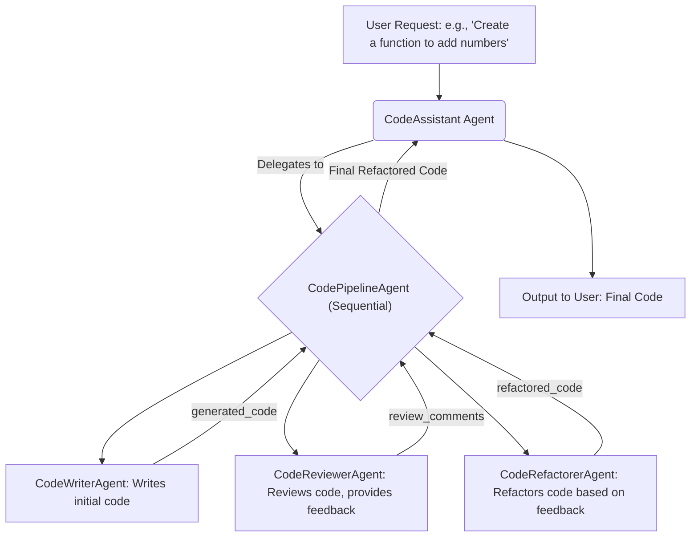

# ADK 程式碼優化器範例

本範例展示了如何使用 Google ADK (Agent Development Kit) 建構一個多步驟的程式碼處理管線。它演示了 ADK 在代理編排方面的強大功能。

## 範例目標

此範例中的代理程式會模擬一個程式碼開發流程：

1.  **程式碼撰寫**：根據使用者請求生成初始 Python 程式碼。
2.  **程式碼審查**：對生成的程式碼進行審查，並提供改進建議。
3.  **程式碼重構**：根據審查意見重構程式碼。

## 關鍵元件

*   `CodeWriterAgent`: 負責根據使用者提供的規格撰寫初始程式碼。
*   `CodeReviewerAgent`: 負責審查 `CodeWriterAgent` 產生的程式碼並提供回饋。
*   `CodeRefactorerAgent`: 負責根據 `CodeReviewerAgent` 的回饋重構程式碼。
*   `CodePipelineAgent`: 一個 `SequentialAgent`，按順序編排上述三個代理的執行。
*   `CodeAssistant`: 作為根代理，使用 `CodePipelineAgent` 來處理使用者的程式碼協助請求。
*   `openlit`: (可選) 用於追蹤和觀察代理執行流程。

## 🚀 如何體驗

此代理已整合到 ADK Web UI 中，無需手動設定 Python 環境或安裝任何套件。

### 前置條件
- 確保已按照[主要 README](../README.md) 完成環境設定
- ADK 服務正在運行（透過 `docker compose up -d` 啟動）

### 存取方式
1. 前往 **ADK Web UI**: http://localhost:8000
2. 在代理清單中選擇 **"Code Optimizer"**
3. 開始與代理互動！

## 代理流程

此範例中的 `CodeAssistant` 代理使用一個名為 `CodePipelineAgent` 的循序代理來處理程式碼請求。這個管線包含三個子代理，它們按順序執行：



1.  **`CodeWriterAgent`**: 接收初始規格說明並撰寫第一版程式碼。其輸出 (生成的程式碼) 會儲存在會話狀態的 `generated_code` 索引鍵中。
2.  **`CodeReviewerAgent`**: 從會話狀態讀取 `generated_code`，進行審查並提供回饋。其輸出 (審查評論) 會儲存在 `review_comments` 索引鍵中。
3.  **`CodeRefactorerAgent`**: 從會話狀態讀取 `generated_code` 和 `review_comments`，然後重構程式碼。最終的程式碼會儲存在 `refactored_code` 索引鍵中，並由 `CodeAssistant` 回傳給使用者。

## 如何理解與使用

此範例的 `adk/code_optimizer/agent.py` 檔案主要用於展示如何定義代理及其之間的互動關係，特別是 `SequentialAgent` 如何編排子代理的執行順序，以及如何在代理之間透過會話狀態傳遞資料。

透過 ADK Web UI，您可以直接與 `CodeAssistant` 代理互動，觀察整個代理管線的執行過程。

## 💡 使用範例

### 建議的互動測試

嘗試向程式碼優化代理發送以下請求：

1. **基礎功能**：
   ```
   請幫我寫一個計算階乘的函式
   ```

2. **演算法實作**：
   ```
   實作一個簡單的快速排序演算法
   ```

### 觀察代理管線執行過程

在 ADK Web UI 中，您可以觀察到代理如何按順序執行：
- 📝 **撰寫**: `CodeWriterAgent` 產生初始程式碼，儲存到 `generated_code`
- 👀 **審查**: `CodeReviewerAgent` 讀取程式碼並提供改進建議，儲存到 `review_comments`
- 🔧 **重構**: `CodeRefactorerAgent` 根據程式碼和建議進行重構，產生 `refactored_code`

這個過程展示了 ADK 在代理編排方面的強大功能，以及如何透過會話狀態在代理間傳遞資料！

## 進一步實驗

*   **修改代理指令**：嘗試修改 `agent.py` 中各個子代理 (Writer, Reviewer, Refactorer) 的 `instruction`，觀察它們行為的變化。
*   **擴展管線**：新增更多步驟到 `CodePipelineAgent` 中，例如一個自動產生測試案例的代理。
*   **整合其他工具**：為 `CodeAssistant` 或其子代理新增其他工具，例如一個用於檢查程式碼風格是否符合特定標準 (如 PEP8) 的工具。
*   **探索 `openlit`**: 如果您已設定 `openlit`，並且在您的執行環境中初始化它 (如 `agent.py` 中所示)，您可以觀察追蹤數據，了解代理執行的詳細步驟和耗時。

## 🔗 相關連結

- **ADK Web UI 主頁**: http://localhost:8000
- **API 文件**: http://localhost:8000/docs  
- **OpenLIT 遙測儀表板**: http://localhost:3000 (查看此代理的執行資料)
- **Grafana 監控儀表板**: http://localhost:3300 (查看效能指標) 