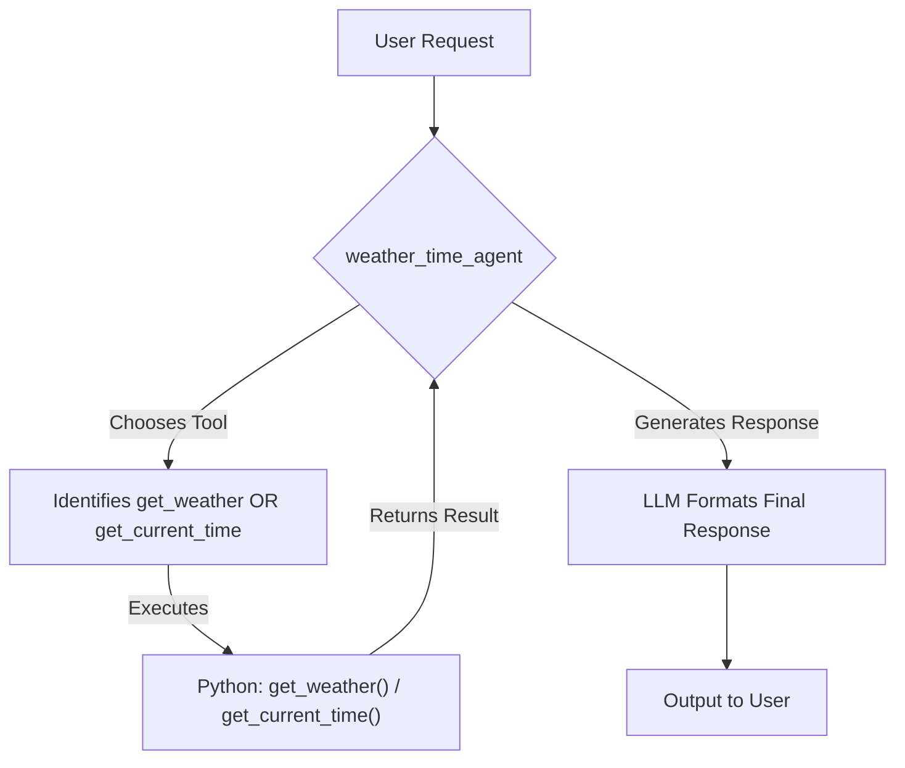

# ADK 多工具代理範例

本範例展示了如何使用 Google ADK (Agent Development Kit) 建構一個能夠使用多個工具的代理。它演示了 ADK 在函式呼叫 (Function Calling) 方面的能力。

## 範例目標

此範例中的代理程式 (`weather_time_agent`) 能夠根據使用者的問題，呼叫相應的工具來獲取資訊：

1.  **獲取天氣**：如果使用者詢問某個城市的天氣，代理會呼叫 `get_weather` 函式。
2.  **獲取時間**：如果使用者詢問某個城市的時間，代理會呼叫 `get_current_time` 函式。

## 關鍵元件

*   `get_weather(city: str) -> dict`: 一個 Python 函式，模擬獲取指定城市天氣報告的功能。目前僅支援 "New York"。
*   `get_current_time(city: str) -> dict`: 一個 Python 函式，模擬獲取指定城市目前時間的功能。目前僅支援 "New York"。
*   `weather_time_agent`: 一個 `Agent`，配置了上述兩個函式作為其工具。它可以理解使用者意圖並選擇合適的工具來回應。

## 🚀 如何體驗

此代理已整合到 ADK Web UI 中，無需手動設定 Python 環境或安裝任何套件。

### 前置條件
- 確保已按照[主要 README](../README.md) 完成環境設定
- ADK 服務正在運行（透過 `docker compose up -d` 啟動）

### 存取方式
1. 前往 **ADK Web UI**: http://localhost:8000
2. 在代理清單中選擇 **"Multi-Tool Agent"**
3. 開始與代理互動！

## 如何理解與使用

此範例主要用於展示如何定義和使用帶有多個工具的代理。`weather_time_agent` 被設定了 `get_weather` 和 `get_current_time` 這兩個工具，展示了 ADK 在函式呼叫 (Function Calling) 方面的能力。

透過 ADK Web UI，您可以直接與代理互動，觀察它如何智能選擇和執行工具。

## 💡 使用範例

### 建議的互動測試

嘗試向多工具代理發送以下請求，觀察它如何智能選擇合適的工具：

1. **天氣查詢**：
   ```
   What is the weather in New York?
   ```

2. **時間查詢**：
   ```
   What time is it in New York?
   ```

3. **綜合查詢**：
   ```
   Can you tell me both the weather and current time in New York?
   ```

4. **測試邊界情況**：
   ```
   What is the weather in London?
   ```
   (觀察代理如何處理不支援的城市)

### 觀察工具選擇過程

在 ADK Web UI 中，您可以觀察到完整的函式呼叫流程：
- 🤖 **智能理解**: 代理分析使用者意圖並決定是否需要呼叫工具
- 🔧 **工具選擇**: LLM 自動選擇 `get_weather` 或 `get_current_time` 並生成函式呼叫請求
- ⚡ **函式執行**: ADK 框架執行對應的 Python 函式  
- 📝 **結果整合**: LLM 將工具執行結果整合到自然語言回應中

## 關鍵概念：函式呼叫

此範例的核心是 ADK 的函式呼叫能力。`weather_time_agent` 被設定了 `get_weather` 和 `get_current_time` 這兩個工具。當您向代理提問時：



1.  大型語言模型 (LLM) 會分析您的請求。
2.  LLM 決定是否需要呼叫其擁有的工具 (`get_weather` 或 `get_current_time`) 來回答問題。
3.  如果需要，LLM 會生成一個包含函式名稱和參數的「函式呼叫」請求。
4.  ADK 框架會執行對應的 Python 函式。
5.  函式的執行結果會返回給 LLM。
6.  LLM 使用此結果來生成最終的自然語言回應給使用者。

## 🔗 相關連結

- **ADK Web UI 主頁**: http://localhost:8000
- **API 文件**: http://localhost:8000/docs  
- **OpenLIT 遙測儀表板**: http://localhost:3000 (查看此代理的執行資料)
- **Grafana 監控儀表板**: http://localhost:3300 (查看效能指標)

透過這些工具，您可以完整體驗從代理互動到遙測監控的整個可觀測性生態系統！ 