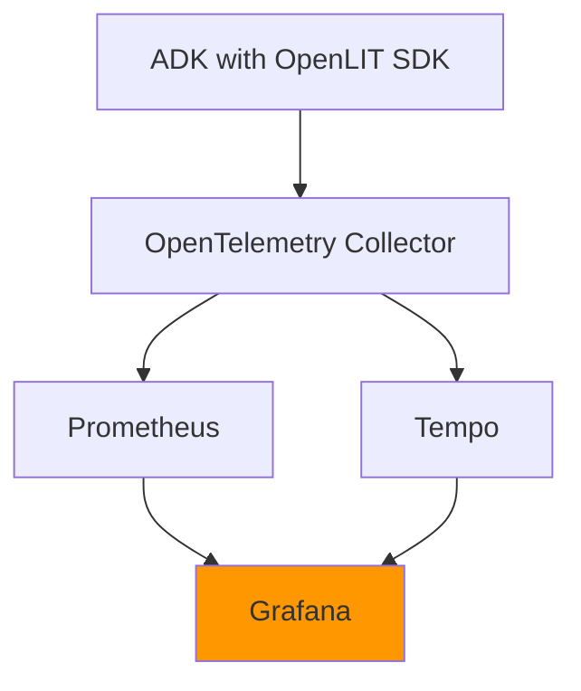
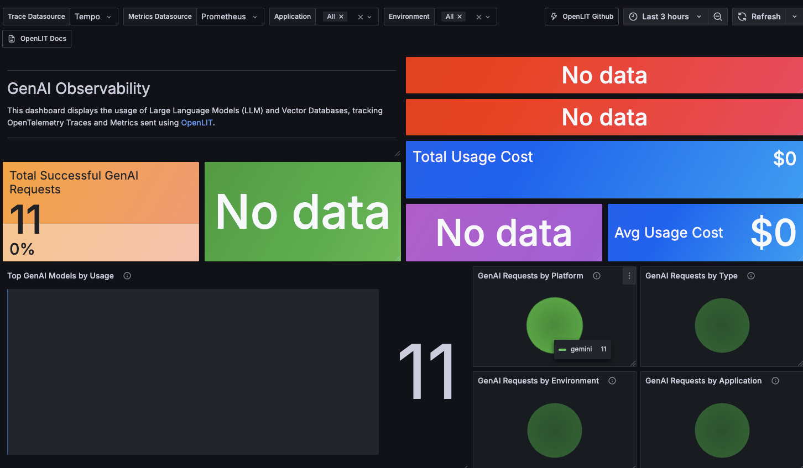
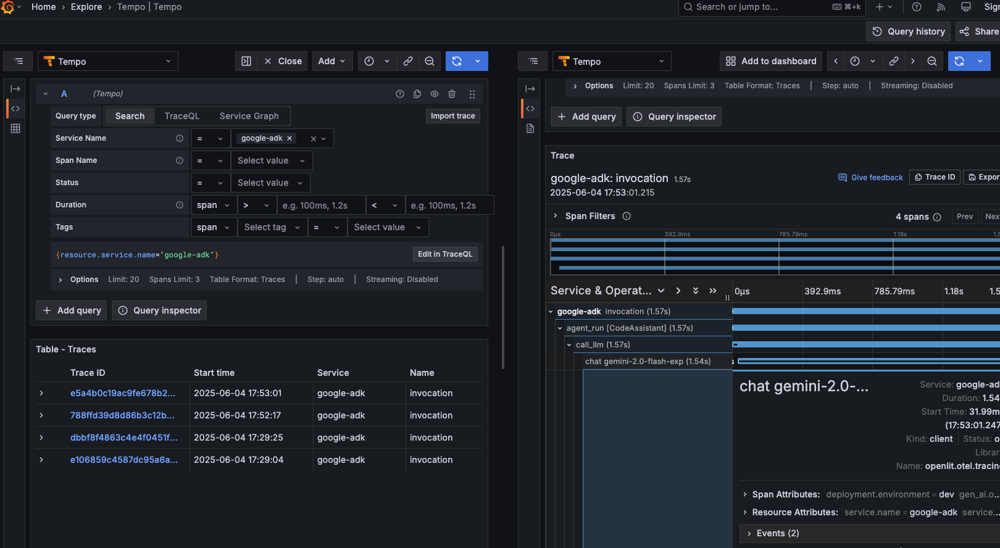

# Grafana LLM 可觀測性儀表板

歡迎來到 bootcamp 的第三階段！在這個階段，您將學習如何將 LLM 遙測資料整合到 Grafana，建立專業的監控儀表板。

## 📋 本階段目標

- 設定 Grafana 與 OpenTelemetry 的整合
- 建立 LLM 效能監控儀表板
- 分析成本、延遲、錯誤率等關鍵指標
- 體驗與現有可觀測性工具的整合

## 🏗️ 架構概覽



## 🚀 快速開始

### 1. 前置條件檢查

確保前兩個階段已完成：
- ✅ ADK 代理正在執行並產生遙測資料
- ✅ OpenLIT 平台正在收集資料

### 2. 確認服務狀態

```bash
# 檢查所有服務是否正常運行
docker compose -f grafana/docker-compose.yaml ps
docker compose -f openlit/docker-compose.yaml ps
docker compose -f adk/docker-compose.yaml ps
```

### 3. 存取 Grafana 儀表板

開啟瀏覽器前往：http://localhost:3300

> 💡 **免登入**: 已啟用匿名模式，無需登入即可直接使用所有功能！

## 📊 儀表板功能

### 🎯 GenAI 可觀測性儀表板



我們提供了一個預配置的 GenAI 可觀測性儀表板，包含以下監控面板：

#### 1. 概覽指標
- **總請求數**: 總 LLM API 呼叫次數
- **平均回應時間**: LLM 呼叫的平均延遲
- **錯誤率**: 失敗請求的百分比
- **總成本**: 累積的 API 使用成本

#### 2. 效能分析
- **回應時間分佈**: 延遲分佈直方圖
- **輸入/輸出 Token 統計**: Token 使用量分析
- **模型使用分佈**: 不同 LLM 模型的使用比例

#### 3. 成本監控
- **每小時成本趨勢**: 成本變化趨勢
- **按模型分類成本**: 各模型的成本佔比
- **成本預測**: 基於使用趨勢的成本預測

### 4. 錯誤分析
- **錯誤類型分佈**: 不同錯誤類型的統計
- **錯誤率趨勢**: 錯誤率隨時間變化
- **問題追蹤**: 具體錯誤案例詳情

## 🔍 Grafana Explore - 完整追蹤鏈路分析

### Tempo 追蹤資料整合



Grafana Explore 是分析分散式追蹤的強大工具，讓您能夠深入探索 LLM 呼叫的完整鏈路：

#### 🎯 核心優勢

- **統一追蹤視圖**: 將 LLM 追蹤整合到現有的微服務追蹤架構中
- **完整鏈路可視化**: 從 ADK 代理到 LLM API 的端到端追蹤
- **現有工具整合**: 無縫融入您現有的可觀測性工具鏈

## 🎉 恭喜！

您已完成整個 LLM 可觀測性 bootcamp！現在您具備了：

1. **建構可觀測的 LLM 應用程式**的能力
2. **收集和分析遙測資料**的技能  
3. **整合現有監控工具**的經驗
4. **建立專業儀表板**的知識
5. **完整鏈路追蹤分析**的技術

### 🌟 關鍵收穫

- **雙重可觀測性體驗**: 體驗了專業 LLM 工具 (OpenLIT) 和 Grafana 生態的整合
- **統一追蹤架構**: 學會將 LLM 追蹤整合到現有的微服務可觀測性架構中
- **完整鏈路可視化**: 從用戶請求到 LLM 回應的端到端可觀測性
