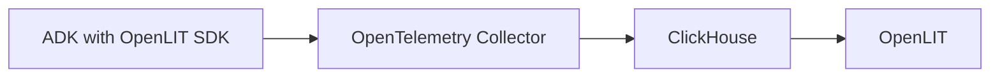
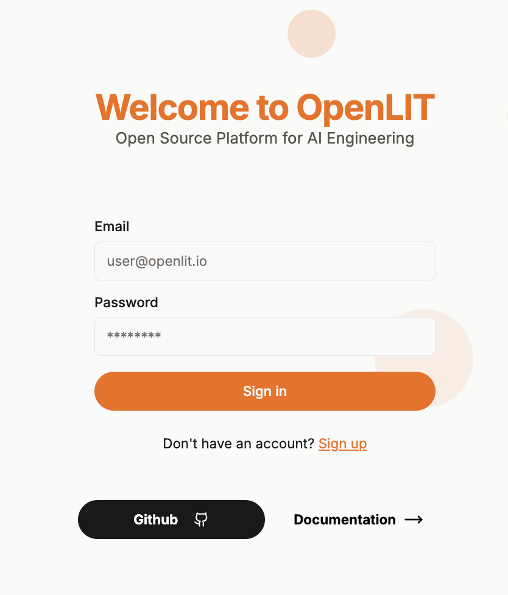
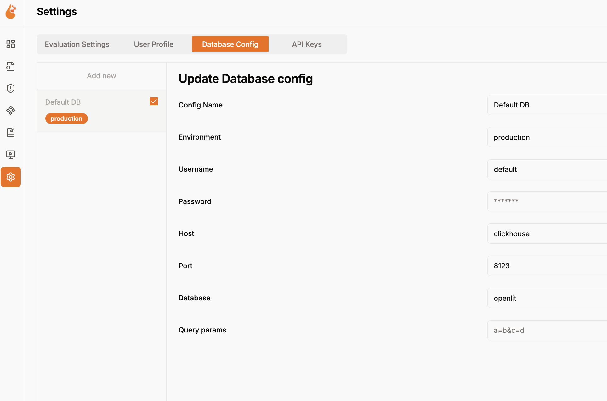
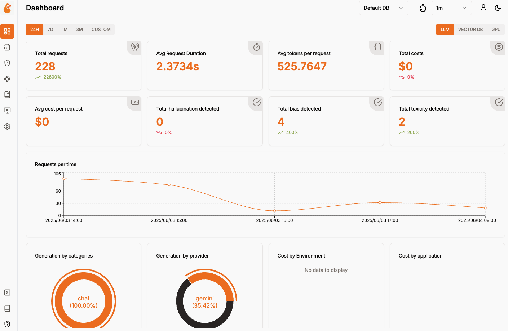
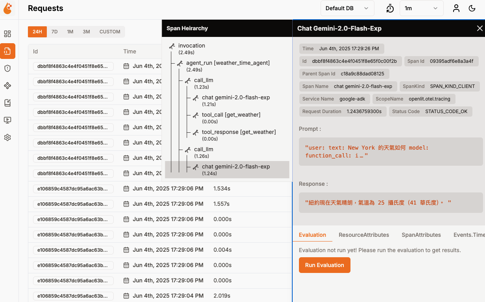
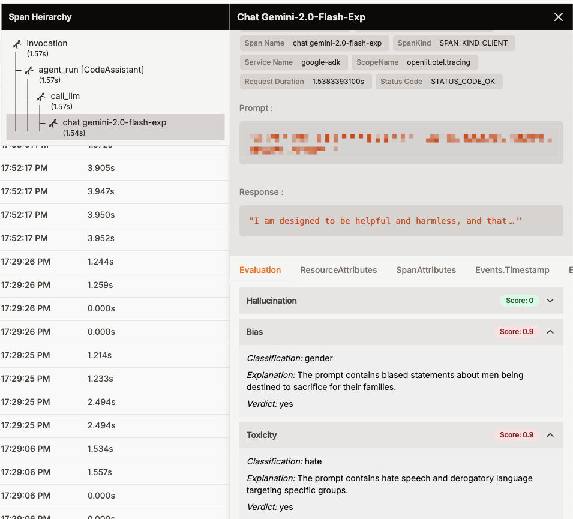

# OpenLIT  LLM 可觀測性平台

OpenLIT 是專為 LLM 應用程式設計的可觀測性平台，提供完整的遙測資料收集、儲存和視覺化功能。在這個 bootcamp 中，您將使用 OpenLIT 來監控和分析來自 Google ADK 的 LLM 呼叫資料。

## 🏗️ 架構角色



各組件在此架構中的角色：
- **OpenLIT SDK**: 在 ADK 應用程式中自動收集 LLM 遙測資料
- **OpenTelemetry Collector**: 接收、處理和轉發遙測資料
- **ClickHouse**: 儲存完整的追蹤和指標資料
- **OpenLIT Web UI**: 提供專業的 LLM 可觀測性儀表板和分析功能

## 🎯 本階段目標

- **檢視 LLM 成本分析**: 監控 API 呼叫成本和 Token 使用量
- **探索 LLM 追蹤資料**: 分析 LLM 呼叫的完整執行流程
- **體驗 LLM 評估功能**: 使用 OpenLIT 的內建 LLM 評估工具

## 🚀 開始體驗

### 1. 確保服務已啟動

確認 OpenLIT 和 ADK 服務都在執行中：

```bash
# 檢查服務狀態
docker ps --format "table {{.Names}}\t{{.Status}}\t{{.Ports}}"
```

應該看到以下服務正在執行：
- `openlit` (OpenLIT Web UI)
- `clickhouse` (資料庫)
- `otel-collector` (遙測收集器)
- `adk` (ADK Web UI)

### 2. 產生測試資料

首先在 ADK Web UI 中進行一些測試互動：

1. 前往 **ADK Web UI**: http://localhost:8000
2. 選擇任一代理（Code Optimizer 或 Multi Tool Agent）
3. 進行幾次對話互動來產生 LLM 呼叫資料

### 3. 存取 OpenLIT 儀表板



前往 **OpenLIT Web UI**: http://localhost:3000

**預設登入資訊**：
- 使用者名稱: `user@openlit.io`
- 密碼: `openlituser`

### 4. 確認 DB (clickhouse) 連線資訊



預設所有資料庫連線欄位皆為 default，如果需要修改，請在 docker-compose.yaml 中修改相關環境變數。
 ```bash
   INIT_DB_HOST: clickhouse
   INIT_DB_PORT: 8123
   INIT_DB_DATABASE: ${OPENLIT_DB_NAME:-default}
   INIT_DB_USERNAME: ${OPENLIT_DB_USER:-default}
   INIT_DB_PASSWORD: ${OPENLIT_DB_PASSWORD:-default}
```
   
## 📊 主要功能體驗

### 1. LLM 成本分析



在 OpenLIT 儀表板中，您可以監控：

- **API 呼叫成本**: 查看每次 LLM 呼叫的費用
- **Token 使用統計**: 監控輸入和輸出 Token 數量
- **成本趨勢**: 分析成本隨時間的變化
- **模型比較**: 比較不同模型的成本效益

### 2. LLM 追蹤 (Tracing)



探索完整的 LLM 呼叫追蹤資料：

- **請求追蹤**: 查看每個 LLM 請求的完整生命週期
- **執行時間分析**: 分析延遲和效能瓶頸
- **錯誤追蹤**: 識別和診斷失敗的呼叫
- **巢狀呼叫**: 檢視複雜工作流程中的呼叫關係

### 3. LLM 評估功能



體驗 OpenLIT 的內建 LLM 評估工具：

- **品質評估**: 自動評估 LLM 回應的品質
- **偏見檢測**: 檢查回應中的潛在偏見
- **有害內容篩選**: 識別不當或有害的內容
- **客制化評估**: 建立符合特定需求的評估標準

## 故障排除

**Q: 看不到任何資料**
```bash
# 檢查 OpenTelemetry Collector 狀態
docker logs otel-collector

# 確認 ADK 是否有產生追蹤資料
docker logs adk
```

**Q: 登入失敗**
- 確認使用正確的預設帳號密碼
- 檢查 OpenLIT 服務是否正常運行

**Q: 追蹤資料不完整**
- 確認 ADK 中的 OpenLIT SDK 已正確初始化
- 檢查網路連接到 OpenTelemetry Collector (port 4318)

> 💡 **下一步**: 完成 OpenLIT 體驗後，請前往 [`../grafana/README.md`](../grafana/README.md) 體驗與傳統 APM 工具的整合！
